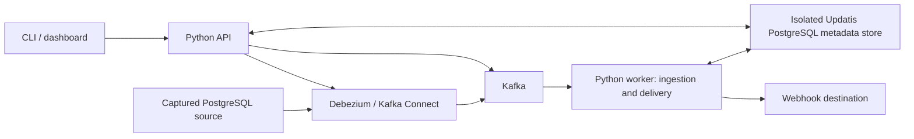

# Target architecture

Status: approved design direction; all product components below are proposed until their roadmap acceptance criteria pass. See [current state](CURRENT_STATE.md) for what exists today.

## Deployment and boundaries

Use one Python codebase with separate API and worker entry points. Internal modules cover configuration, connector reconciliation, normalization, storage, delivery, recovery, and telemetry. Ingestion and delivery can run as supervised loops within the worker; they do not require separate microservices. There is no Redis/NATS addition.

Compose includes Kafka, Connect, metadata PostgreSQL, API, worker, and an example source plus webhook receiver for the quickstart. Source and metadata are **separate services/instances**, with distinct databases, credentials, volumes, network permissions, and backup lifecycles. Production sources can be external. No metadata schema/table belongs in a captured source. Registration rejects known metadata endpoints/identities, including resolved aliases where identifiable; deployment policy and operator documentation prohibit capturing the metadata store even when aliases cannot be reliably detected.

One local broker is a development topology, not an HA claim. Pin a tested compatible image set and provision Kafka/Connect storage topics, partition counts, retention, health checks, persistent volumes, and resource limits explicitly. Do not select versions solely because the prototype uses them.

## Responsibilities

| Component | Responsibility | Must not do |
| --- | --- | --- |
| PostgreSQL source | Application data, logical replication publication/slot | Store Updatis state or receive Updatis runtime DDL |
| Debezium/Connect | Snapshot/capture, source progress, connector execution | Decide webhook delivery success |
| Kafka | Durable captured event transport and bounded replay history | Act as the only delivery-attempt ledger |
| API | Validate configuration, authorize operations, expose state, reconcile desired connector state | Execute unbounded delivery work in request handlers |
| Worker ingestion loop | Read ordered records, normalize, durably stage/quarantine, then commit contiguous offsets | Commit an unpersisted record or conflate ingestion with delivery success |
| Worker delivery loop | Claim partition ownership, send partition head, persist attempts/acknowledgements/gaps | Deliver later records while the head is nonterminal |
| Metadata PostgreSQL | Pipeline configuration, immutable event identity, delivery/recovery/audit state | Be included in source capture or rely on source credentials |
| CLI/dashboard | Use the same versioned API; display evidence and limitations | Hold independent state or bypass server authorization |

API process scaling and worker partition concurrency are distinct. Start with one API/worker deployment; schema ownership/fencing still needs correctness under restarts and accidental overlapping workers. A single supervised reconciler is sufficient initially; later replicas require elected/fenced reconciliation, not multiple conflicting writers.

## Proposed logical metadata model

Introduce explicit migrations; do not repurpose legacy startup DDL. Exact SQL is implementation work.

- `pipelines` and immutable configuration revisions: ID, source identity/epoch, table selection, destination revision, desired state, supported envelope version, secret references.
- `connector_observations`: desired/applied revision, Connect status, error summaries, last reconciliation and capture observations.
- `ingest_checkpoints`: source stream epoch/topic/partition, highest contiguous durably staged next offset, associated Kafka group.
- `events`: original record identity, key, operation, before/after, source schema/table/position, capture times, payload hash, normalized envelope, original transport coordinates. Unique stream epoch/topic/partition/offset guards redelivery into the inbox.
- `partition_delivery_state`: head/cursor, active lease and fencing generation, oldest pending age, blocked/exhausted status. One active owner per pipeline destination and partition.
- `deliveries` and `delivery_attempts`: immutable event/destination revision reference, state, durable attempt budget, next due time, request/response metadata, redacted error, lease token. Payload is not duplicated into every attempt log.
- `dead_letters` and `ordering_gaps`: original coordinates and identity, reason/stage, terminal outcome, timestamps, operator actions, and links to any recovery job. A gap records the missing normal delivery and remains auditable after redrive.
- `recovery_jobs` and job items: explicit selection/bounds, actor, config revision, original event IDs, independent status/attempts, cancellation and rate limits. Historical replay later uses an independent consumer group.
- `audit_events`: actor/action/configuration/recovery outcomes and reason; secrets and default row payloads excluded.

Retain immutable input separately from mutable delivery state. Deduplication metadata must survive payload pruning for the documented deduplication horizon. Do not cascade deletion of an event into unresolved gaps, dead letters, or active recovery jobs. Provide capacity thresholds before adding long-term retention automation.

## Data path and transaction boundaries

1. Validate a configuration revision and its secret references. Check source prerequisites without modifying arbitrary source application tables. Source publication/slot creation must follow the declared onboarding mode and scoped privileges.
2. Create/reconcile the named connector idempotently. Persist desired versus observed state and expose failure independently from API liveness.
3. Consume raw Debezium JSON using explicitly configured serialization. Support snapshot/read, create, update, delete, and documented tombstone/control-record behavior; reject unsupported schemas/types predictably.
4. In one metadata transaction, persist each event or its pending quarantine decision and advance only the contiguous staged position for that partition. Then commit the explicit Kafka next offset for that partition. Metadata success followed by Kafka failure causes safe re-ingestion/deduplication. A staged quarantine does not jump the delivery cursor over earlier unresolved records; finalize its gap/advancement when it reaches the delivery head.
5. Deliver the lowest unresolved offset for each partition. Persist attempt intent before the network request. Treat a timeout as an ambiguous result, not proof the destination did nothing.
6. Persist destination acknowledgement before advancing the delivery cursor. On exhaustion, atomically write the dead letter and ordering gap, mark the delivery terminal, and advance the cursor. If that transaction fails, the partition remains blocked.

Kafka commits acknowledge **durable intake**, not webhook success. Intake may advance while an earlier webhook is retrying, up to configured queue capacity. This separation must be visible in metrics and UI: ingestion lag, delivery backlog, oldest pending age, and gaps are different signals.

There is no distributed transaction with a webhook. A crash after a successful remote action but before local acknowledgement produces duplicates. A fencing token prevents a stale worker from mutating local state; it cannot retract an HTTP request already received. Destinations must enforce idempotency and, when needed, source-version checks. The [reliability contract](RELIABILITY_CONTRACT.md) is normative.

## Configuration and lifecycle

Use a versioned declarative configuration document accepted by both CLI and API. Keep secret values out of stored/exported configuration; refer to injected secrets. Validate ranges, URLs, table/key/type constraints, source/metadata isolation, supported versions, and retry/capacity policy before activation.

v0.1 supports explicit create/start/status/pause/resume and safe stop for the narrow pipeline. v0.2 adds reconciled lifecycle and richer dashboard operations. Pause delivery and pause capture are different actions: pausing delivery can grow the inbox, while pausing capture can retain source WAL. Show the consequence before each operation.

Pin events to a destination/configuration revision. Do not silently redirect an existing backlog when the webhook URL changes. Reassignment requires an explicit audited action and documented identity semantics. Connector deletion must not implicitly delete slots, Kafka history, metadata, or secrets. Destructive cleanup is separate and guarded.

## Security and observability

Baseline protections belong in v0.1: authenticated management API, isolated Connect/Kafka listeners, scoped source/metadata accounts, secret injection/redaction, explicit trusted proxies, bounded payloads, and safe outbound webhook policy. Block metadata/cloud-credential endpoints and disallowed network ranges; validate redirects/DNS resolution per request and enforce egress restrictions. Local example endpoints require a narrow explicit development allowlist. Webhook signing has a versioned header/rotation design, and production transport requires TLS.

Expose distinct health/readiness for API and worker, and pipeline state derived from connector observations, durable checkpoints, and delivery outcomes. Logs carry pipeline, event, partition, attempt, and recovery IDs without row payloads by default. Bounded-cardinality counters cover intake, acknowledgement, retries, quarantine, gaps, and queue pressure. v0.2 adds Prometheus endpoints and dashboard views; v0.5 adds OpenTelemetry propagation/export. No API metric registry is assumed to see another process's memory.

## Recovery and compatibility boundaries

Back up metadata independently; preserve Kafka/Connect topic state and source replication identity under documented procedures. Restoring old metadata while retaining newer committed Kafka offsets can skip records. Recovery must compare durable checkpoints against Kafka positions and retained history, then safely rewind/rebuild or explicitly declare an unrecoverable gap. Never silently continue across missing history.

PostgreSQL slots can retain WAL while capture is stalled. Monitor retained bytes/age and source free space; publish an outage budget and an explicit rebootstrap procedure when history is unavailable. See [Debezium PostgreSQL documentation](https://debezium.io/documentation/reference/stable/connectors/postgresql.html). This source informs the design, not evidence that the repository already handles it.

Exact runtime versions, SQL type mapping, metadata capacity limits, retry values, and backup objectives remain foundation decisions. PostgreSQL destination support must use a separate target identity and must not target the Updatis metadata database; feedback-loop prevention is required for captured destination tables.
